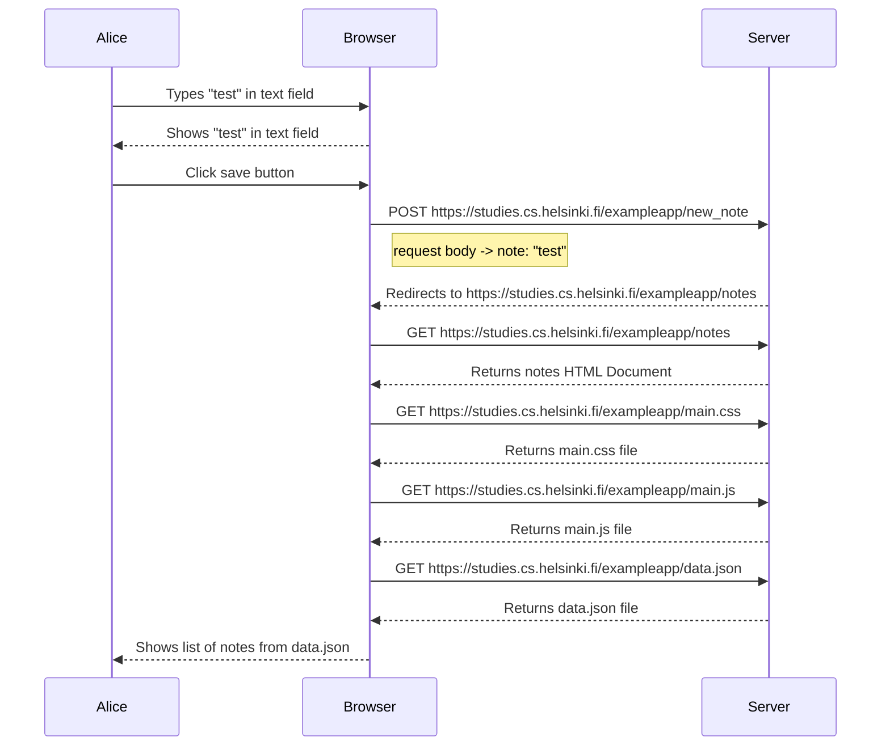

```mermaid
sequenceDiagram
participant Alice
participant Browser
participant Server

Alice->>Browser: Types "test" in text field
Browser-->>Alice: Shows "test" in text field

Alice->>Browser: Click save button
Browser->>Server: POST https://studies.cs.helsinki.fi/exampleapp/new_note
Note right of Browser: request body -> note: "test"
Server-->>Browser: Redirects to https://studies.cs.helsinki.fi/exampleapp/notes
Browser->>Server: GET https://studies.cs.helsinki.fi/exampleapp/notes
Server-->>Browser: Returns notes HTML Document
Browser->>Server: GET https://studies.cs.helsinki.fi/exampleapp/main.css
Server-->>Browser: Returns main.css file
Browser->>Server: GET https://studies.cs.helsinki.fi/exampleapp/main.js
Server-->>Browser: Returns main.js file
Browser->>Server: GET https://studies.cs.helsinki.fi/exampleapp/data.json
Server-->>Browser: Returns data.json file
Browser-->>Alice: Shows list of notes from data.json
```
